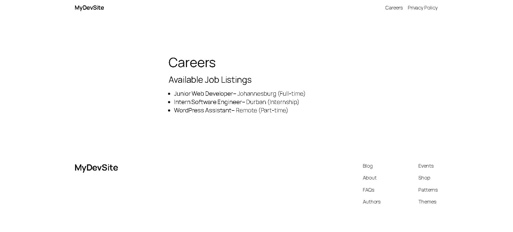

# Job Listings Plugin
A custom WordPress plugin that registers a shortcode to display job listings on any page or post.  
This project demonstrates practical PHP and WordPress development skills, including plugin structure, shortcode registration, and dynamic content rendering.  
For convenience, a static demo page is also hosted on GitHub Pages to showcase the plugin output without requiring WordPress installation.

---

## Features
- Registers a shortcode `[job_listings]` for easy use in pages or posts.
- Displays a clean, bulleted list of job opportunities.
- Simple structure for recruiters to review and extend.
- Safe coding practices (checks `ABSPATH` to prevent direct access).
- Includes a static HTML demo for live preview on GitHub Pages.

---

## Installation (WordPress)
1. Download or clone this repository.
2. Copy the folder `job-listings-plugin` into your WordPress installation under:

3. Log in to WordPress Admin → go to **Plugins**.
4. Activate **Job Listings Plugin**.

---

## Usage (WordPress)
1. Create or edit a page in WordPress.
2. Add the shortcode:

3. Publish the page → job listings will appear.

---

## Example Output

---

## Live Demo (GitHub Pages)
Since GitHub Pages cannot run PHP, a static HTML file (`index.html`) is included to demonstrate the plugin’s output.  
View the demo here: **[GitHub Pages Live Demo](https://llaa-iqah.github.io/job-listings-plugin-demo/)/)**

---

## Screenshot

---

## Author
Developed by **Llaa-iqah**  
